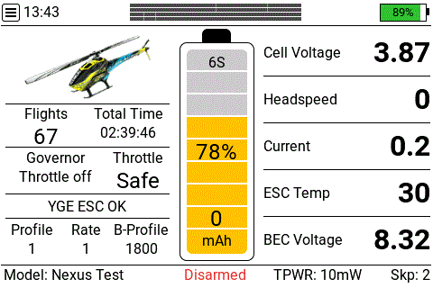
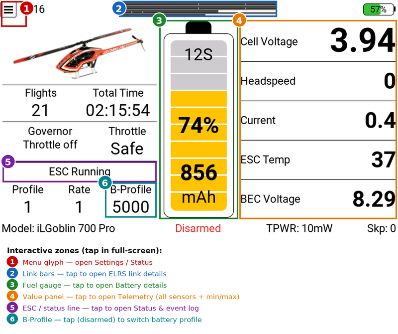

# UltiDash

**A full-screen LVGL dashboard widget for EdgeTX / Rotorflight helicopters.**

`Status: v0.5.1 — experimental, under testing`

UltiDash brings flight telemetry, battery state, ESC status, the ELRS link and radio
info together on a single self-contained screen — designed so you can drop the EdgeTX
top bar and run it full-screen. Everything is configured **inside the widget** (a
fullscreen menu), and tapping a panel opens a detailed view of it.



*Flight view, the tap-to-open detail pages (telemetry, battery, ELRS, status), the
battery-profile picker, the stats page and the settings menu.*

### The dashboard at a glance

The flight view packs a lot in; tapping a panel (in full-screen) drills into it:



> ⚠️ **Work in progress / under testing.** UltiDash is an experimental project and is
> still being tested in the field. Expect rough edges and changes.
> **Use entirely at your own risk — there is NO warranty of any kind (see [License](#license)).**
> Intended for the **RadioMaster TX15 and TX16S MK3 running ELRS**, on EdgeTX 2.12 with
> **Rotorflight 2.3 (required)**. It runs in principle on the **TX16S MK2** (480×272)
> too, but that radio is **not actively tested** and its aspect ratio is less ideal for
> the layout. Feedback and bug reports are very welcome.

---

## A personal note

UltiDash was originally built **just for my own personal use** — a way to combine
everything I need into a single widget. I decided to make it available anyway, in case
it's useful to someone else.

It builds on and reuses the work of several authors (see [Credits](#credits) and
[`NOTICE.md`](NOTICE.md)). Should any of them have concerns about their work being reused
here, I will of course respect that.

---

## Features

- **Flight dashboard** — top bar (date/time, the ELRS link as up to four stacked bars,
  radio battery), a central reserve-adjusted battery gauge, a left status panel (model
  image, flights & flight time, governor + throttle, a multi-vendor ESC status/fault line,
  profile/rate/battery-profile) and a right values panel (voltage, headspeed, current,
  ESC temp, BEC).
- **Statistics view** — auto-shown when disarmed/disconnected: per-value Latest/Min/Max
  table (headspeed **per PID profile**), total flights & flight time, capacity used.
- **Configurable values** — the 5 right-hand panel slots and the Telemetry detail page are
  freely assignable to any model sensor (a smart **Voltage (auto)** slot keeps the
  warn-colored cell/battery voltage).
- **Tap-to-open detail pages** (full-screen) — tap a panel to drill in:
  - **Telemetry** (tap the value panel): a 3-column grid of up to 12 chosen sensors, each
    with its **unit** and the EdgeTX session **low/high** (`min .. max`).
  - **ELRS link** (tap the top-bar bars): RQ, TQ, 1RSS, 2RSS, SNR and TPWR as labelled
    bars with thresholds, plus SNR / active antenna / session RQ-min.
  - **Status & events** (tap the status line): arm/governor/throttle summary, the live
    status line and a timestamped ESC event log.
  - **Battery** (tap the gauge): a cell-voltage scale with the active thresholds marked
    plus the battery in the dashboard look.
- **Battery-profile picker** (tap the **B-Profile** field, **disarmed**) — switch the
  active Rotorflight battery profile (shown with their capacities) right from the
  dashboard, via the RFTool MSP API and without rebooting the FC. *(This is the only place
  UltiDash writes to the FC — disarmed only; everything else is read/announce-only.)*
- **In-widget settings menu** — no EdgeTX option list to fight: open the full-screen menu
  and edit everything with real toggle switches, dropdowns and +/− steppers, grouped into
  named pages. Settings are **saved per model** on the SD card.
- **Voice & vibration callouts, configurable per alert** — fuel %, cell voltage,
  armed/disarm, ELRS link-quality, RSSI/signal, telemetry-lost, main-power-loss,
  **BEC-drop**, **ESC-load** and skipped-packet warnings, plus optional **switch
  announcements** (motor / rescue / governor / profile). Every alert has its own page:
  on/off, **repeat** (count/interval), **escalation volume**, vibration — with a master
  mute, English/German voice packs and two volume worlds (fixed callout volume and an
  optional **master-volume control via GVAR**, boosted while a critical alert repeats —
  needs a small one-time model setup, see the reference §5.4).
- **Main-power-lost mode** — a collapsed main pack with live telemetry (backup buffer
  took over) flips the dashboard into a dedicated state: **MAIN POWER LOST** status, the
  repeating callout counts the **live BEC voltage** down, and recovery is announced if
  the pack comes back mid-flight.
- **ESC load monitor** *(optional, off by default)* — a model GVAR delivers the ESC's
  continuous-current limit (mapped via the RF2/RFTool Lua suite's per-model GVAR
  feature); UltiDash shows the utilization as a green/yellow/red bar (plus an *ESC Load*
  telemetry slot) and can alarm on sustained overload.
- **Toolbox** *(optional)* — the **RF Adjustment Map / Editor** tool pages built in: see
  and touch-adjust Rotorflight adjustment functions from the radio. Needs a one-time
  model setup (channels + a dedicated GVAR) — guide in
  [docs/TOOLBOX.md](docs/TOOLBOX.md).
- **Second-screen views** — place UltiDash again on another screen set to **ELRS details**
  or **Status info**; these passive instances mirror the dashboard's data.
- **No external libraries** — UltiDash loads only its own files.

## Requirements

- EdgeTX **color radio** with LVGL widget support (developed on 2.12).
- **Rotorflight 2.3** (required) with the **RFTool** widget installed (provides
  connection/arm state and MSP data). MSP is only read on connect/disarm — never during
  armed flight.
- An **ELRS** RF link: the link bars and the link/RSSI warnings read ELRS telemetry
  sensors (`RFMD`, `RQly`, `TQly`, `1RSS`, `2RSS`, `RSNR`, `TPWR`, `ANT`).
- Telemetry sensors (fixed names): `Vbat`, `Vcel`, `Cel#`, `Curr`, `Capa`, `Bat%`,
  `Vbec`, `Tesc`, `Tmcu`, `Hspd`, `Gov`, `ARM`, `ARMD`, `PID#`, `RTE#`, `BAT#`, `Thr`,
  `Esc#` + `EscF` (ESC status), the ELRS sensors above, and `*Skp` (skipped-packet counter
  — the label really starts with `*`).
- Sounds in `/SOUNDS/en/ultidash/` and `/SOUNDS/de/ultidash/` (all included, in their own
  subfolders so they don't clash with the EdgeTX voice pack; pick the language in
  *Alerts ▸ Voice / mute*). Spoken numbers/units (`percent`, `volts`, digits) still come
  from your EdgeTX voice pack.
- Optional model image in `/images/`: a single file named after the **Rotorflight model
  name** is enough — e.g. `MyHeli.png` or `MyHeli.jpg`. (Advanced/optional: a
  `<model>-<cells>S` variant is preferred when present; otherwise the plain name, then the
  EdgeTX model bitmap, is used.)

## Installation

Copy the folders from this repo to the **root of your radio's SD card**, merging with
what's already there:

```
WIDGETS/UltiDash/      →  <SD>/WIDGETS/UltiDash/
SOUNDS/en/ultidash/    →  <SD>/SOUNDS/en/ultidash/
SOUNDS/de/ultidash/    →  <SD>/SOUNDS/de/ultidash/
```

Then add the **UltiDash** widget to a (full-screen) widget zone on a model screen. The
only EdgeTX widget option is **`ViewMode`** (Dashboard / ELRS details / Status info) —
leave it on **Dashboard** for the main instance. Everything else is configured inside the
widget (see below).

> ⚠️ **First, fix duplicate/empty telemetry sensors — do this before anything else.**
> EdgeTX auto-discovery often creates **empty default sensors** (`RxBt`, `Curr`, `Capa`,
> `Bat%`, …) that **shadow Rotorflight's real sensors of the same name**. The symptom in
> UltiDash: **Current is blank and the fuel gauge shows `-` / `-`** instead of `%` / `mAh`.
> **Fix (one-time, per model):** on the model's *Telemetry* page **delete every sensor that
> shows `—`/no value**, then turn **"Discover new sensors" off**. Full details in
> **[docs/REFERENCE.md §6.1](docs/REFERENCE.md)**.

## Configuration

There is essentially **one EdgeTX widget option, `ViewMode`** — all real configuration
lives in an **in-widget settings menu**:

1. **Long-press** the widget → **Full screen**.
2. Tap the **menu symbol** (the ☰ glyph, top-left, next to the clock) — *disarmed only*.
3. The menu offers **Settings** (a submenu of the configuration groups), **Status**,
   **Toolbox** and **Reset settings to defaults**. The menu and the Settings submenu are
   laid out as a button grid; each group opens its own page.

The **Settings** submenu groups:

| Group | Covers |
|-------|--------|
| **Display** | top-left content + clock format, color scheme / background, stats-page mode, voltage display, the top-bar bar toggles, TPWR bar max, detail-page behaviour, quiet bars |
| **Tele Main** | the 5 right-hand dashboard value slots (curated sensors, *Voltage (auto)*, *ESC Load (calc)* — or **any raw sensor** via the native picker) |
| **Tele Details** | the 12 sensor slots of the Telemetry detail page (same hybrid pickers) |
| **Battery** | reserve %, fuel-callout density, cell-threshold source (FC config / manual cell voltages), startup cell-check delay |
| **Thresholds** | link (RQly) warn/crit, RSSI warn/crit/hold, skipped-packet limit, power-warn voltage, BEC warn/crit |
| **ESC load** | the ESC continuous-current load monitor: master switch, limit GVAR, warn/critical %, alarm hold time |
| **Volume** | fixed callout volume + when it applies, and the optional **master-volume bridge via GVAR** with normal / escalation percentages |
| **Alerts** | **voice language (English / Deutsch)**, master mute, and **one page per alert**: active, repeat (count / interval), escalation volume, vibrate |
| **Switch voice** | announce motor / rescue / governor / profile from a chosen TX switch (physical **or** logical, native picker) |
| **General** | per-craft config, and the **debug log** (off by default) + how many log sessions to keep |
| **Toolbox** | the RF adjustment tools: activation switch, channels, GVAR pulse, look & voice (see [docs/TOOLBOX.md](docs/TOOLBOX.md)) |

Each group page also has a **Reset … to defaults** button that resets only that page; the
menu's *Reset to defaults* resets the whole model.

> 🎨 **About the color scheme (Display → Color scheme).** Three palettes: the built-in
> **UltiDash** look (the path I actually fly and test), an **EdgeTX theme** option
> (theme-aware — **not my personal focus**, less tested, feedback welcome), and **UltiDash
> dark** (high-contrast white-on-black with neon accents). If something looks off under the
> theme palette, please open an issue with a screenshot.

Edits are **saved automatically** when you leave the page (back arrow or RTN) and stored
**per model** in `/WIDGETS/UltiDash/cfg_m_<model-slot>.cfg`. The slot keying survives
Rotorflight's "set model name on TX" renaming. Enable *General → Config file per craft* to
keep a separate file per craft flown from the same model slot.

See **[docs/REFERENCE.md](docs/REFERENCE.md)** for the full settings list, the layout
breakdown, the callout matrix, the detail pages and the "what is shown when" tables.

### Touch navigation (full-screen)

| Tap | Opens |
|-----|-------|
| ☰ menu glyph (top-left) | the settings menu (disarmed only) |
| the right value panel | the **Telemetry** detail page |
| the link bars | the **ELRS** detail page |
| the ESC/status line | the **Status & events** page |
| the battery gauge | the **Battery** detail page |
| the **B-Profile** field | the **battery-profile picker** (disarmed only) |
| anywhere on a detail page / RTN | back to the dashboard |
| anywhere on the stats page | dismiss it (returns next flight) |

Detail tap-zones can be turned off (*Display → Tap zones for detail pages*); the menu
glyph always stays active.

## Credits

UltiDash is a merged/derivative work. All credit to the original authors:

- **HeliDash** — base widget, layout & telemetry — based on
  [HeliWidget by gismo2004](https://github.com/gismo2004/HeliWidget) (GPL-3.0)
- **ePowerbar / eBitmap / eStatus** — battery model, model image, ESC decoder — by
  Rob 'bob00' Gayle, [etx-widgets](https://github.com/bob01/etx-widgets) (GPLv3)
- **BattAnalog** — top-bar battery icon style — by
  [Offer Shmuely](https://github.com/offer-shmuely/edgetx-x10-widgets)

## License

UltiDash is licensed under **GPLv3** (see [`LICENSE`](LICENSE)). All reused components are
GPL-compatible: the HeliDash base (gismo2004) is **GPL-3.0**, and the etx-widgets-derived
parts are GPLv3 — so the combined work can be distributed under GPLv3 with the
attributions in [`NOTICE.md`](NOTICE.md) preserved.

**No warranty.** This software is provided *as-is*, without warranty of any kind; you use
it **entirely at your own risk**. See [`NOTICE.md`](NOTICE.md) for the full attribution.
*(Plain-language summary, not legal advice.)*
