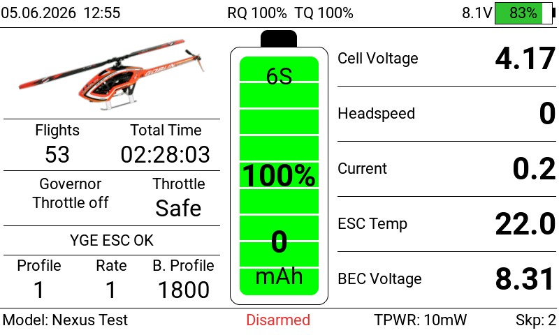
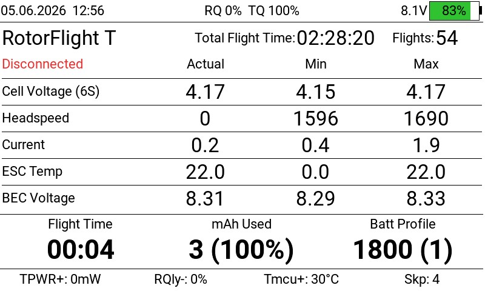

# UltiDash

**A full-screen LVGL dashboard widget for EdgeTX / Rotorflight helicopters.**

`Status: v0.1 — experimental, under testing`

UltiDash brings flight telemetry, battery state, ESC status and radio info together
on a single self-contained screen — designed so you can drop the EdgeTX top bar and
run it full-screen.



*Flight view (above) and the statistics page shown when disarmed/disconnected (below).*



> ⚠️ **Work in progress / under testing.** Version **0.1** is an early experimental
> release and is still being tested in the field. Expect rough edges and changes.
> **Use entirely at your own risk — there is NO warranty of any kind (see [License](#license)).**
> Intended for the **RadioMaster TX15 and TX16S MK3 running ELRS**, on EdgeTX 2.12 with
> **Rotorflight 2.3 (required)**. Feedback and bug reports are very welcome.

---

## A personal note

UltiDash was originally built **just for my own personal use** — a way to combine
everything I need into a single widget. I decided to make it available anyway, in case
it's useful to someone else.

It builds on and reuses the work of several authors (see [Credits](#credits) and
[`NOTICE.md`](NOTICE.md)). Should any of them have concerns about their work being reused
here, I will of course respect that.

---

## Features

- **Top bar** — date/time, the ELRS link as up to four thin stacked bars (`RQ`/`TQ` link
  quality + `1RSS`/`2RSS` signal headroom, color-by-zone with threshold ticks) and a
  compact radio (TX) battery icon with voltage + % (fill turns red below the warning
  threshold). Replaces the EdgeTX top bar. Each bar group and the TX voltage can be
  toggled individually.
- **Center battery gauge** (ePowerbar model) — reserve-adjusted fuel %, discrete
  green/yellow/red colors, cell count (e.g. `6S`), big % and used mAh, plus a
  startup cell-check (grey progress bar + warning if the pack isn't full).
- **Left status panel** — model image (from `/images`), total flights & flight time,
  Governor state + Throttle, a multi-vendor **ESC status / fault line** (YGE/OpenYGE,
  Scorpion, HobbyWing, FLYROTOR, OMP, BLHeli_32) with arming-disable reasons, and a
  compact Profile / Rate / Battery-Profile row.
- **Right values panel** — cell/battery voltage, headspeed, current, ESC temp, BEC.
- **Statistics view** — auto-shown when disarmed/disconnected: per-value Actual/Min/Max
  table, total flights & total flight time (from Rotorflight MSP), capacity used.
- **Voice & vibration callouts** — fuel %, low/critical cell voltage, armed/disarm,
  ELRS **link-quality**, **RSSI/signal** and **telemetry-lost** warnings, a
  **main-power-loss** warning and a **skipped-packet** warning (link/RSSI/power/packet
  warnings are armed only). All spoken via UltiDash's own WAVs; individually configurable.
- **No external libraries** — UltiDash loads only its own files.

## Requirements

- EdgeTX **color radio** with LVGL widget support (developed on 2.12).
- **Rotorflight 2.3** (required) with the **RFTool** widget installed (provides
  connection/arm state and MSP data). MSP is only read on connect/disarm — never during
  armed flight.
- An **ELRS** RF link: the top-bar link bars (RQ / TQ / 1RSS / 2RSS) and the link/RSSI
  warnings read ELRS telemetry sensors (`RFMD`, `RQly`, `TQly`, `1RSS`, `2RSS`, `RSNR`).
- Telemetry sensors (fixed names): `Vbat`, `Vcel`, `Cel#`, `Curr`, `Capa`, `Bat%`,
  `Vbec`, `Tesc`, `Tmcu`, `Hspd`, `Gov`, `ARM`, `ARMD`, `PID#`, `RTE#`, `BAT#`, `RQly`,
  `TQly`, `TPWR`, `Thr`, and (for ESC status) `Esc#` + `EscF`, plus `*Skp` (skipped-packet
  counter — the sensor label really starts with `*`), and the ELRS link sensors above.
- Sounds in `/SOUNDS/en/ultidash/` (all included, in their own subfolder so they don't
  clash with the EdgeTX voice pack): `battry`, `batlow`, `batcrt`, `armed`, `disarm`,
  `telem_lost`, `telem_ok`, `link_warn`, `link_crit`, `rssi_warn`, `rssi_crit`,
  `pwr_backup`, `skp_high`. Spoken numbers/units (`percent`, `volts`, digits) still come
  from your EdgeTX voice pack.
- Optional model image in `/images/`: a single file named after the **Rotorflight model
  name** is enough — e.g. `MyHeli.png` or `MyHeli.jpg`. (Advanced/optional: a
  `<model>-<cells>S` variant, e.g. `MyHeli-6S.png`, is preferred when present so you can
  use a different picture per cell count; otherwise the plain name, then the EdgeTX model
  bitmap, is used.)

## Installation

Copy the folders from this repo to the **root of your radio's SD card**, merging with
what's already there:

```
WIDGETS/UltiDash/      →  <SD>/WIDGETS/UltiDash/
SOUNDS/en/ultidash/    →  <SD>/SOUNDS/en/ultidash/
```

Then add the **UltiDash** widget to a (full-screen) widget zone on a model screen.

## Configuration

The widget options cover reserve %, voltage display (cell/battery), the cell-threshold
source (`CellSource` = FC config **or** Manual, with manual `CellFull`/`CellLow`/
`CellCritical` values), startup delay, the alert thresholds (`CalloutInt`, `RQlyWarn`/
`RQlyCrit` for link quality, `RssWarn`/`RssCrit` for RSSI signal headroom plus `RssHold`
hold time, `PwrWarnV`, `SkpLimit`), the color scheme (`ColorScheme` = fixed UltiDash
palette or follow the EdgeTX theme), what the top-left area shows (`TopLeft` = model image
or a timer), and per-element top/bottom-bar toggles (`ShowRQly`, `ShowTQly`, `ShowRSSI`,
`ShowTxV`, `ShowTPWR`).

**Every alert/announcement has its own on/off switch** — startup cell-check (`SndCellChk`),
fuel (`SndFuel`), voltage (`SndVolt`), armed/disarm (`SndArm`), telemetry (`SndTelem`),
link quality (`SndLink`), RSSI/signal (`SndRssi`), main power loss (`PwrWarn`) and skipped
packets (`SkpWarn`). **`Mute` (None / All)** is a master kill-switch that silences
everything (voice + vibration); **`Haptic`** is the master for vibration.

See **[docs/REFERENCE.md](docs/REFERENCE.md)** for the full option list, the layout
breakdown, the callout matrix and the "what is shown when" tables.

## Credits

UltiDash is a merged/derivative work. All credit to the original authors:

- **HeliDash** — base widget, layout & telemetry — based on
  [HeliWidget by gismo2004](https://github.com/gismo2004/HeliWidget) (GPL-3.0)
- **ePowerbar / eBitmap / eStatus** — battery model, model image, ESC decoder — by
  Rob 'bob00' Gayle, [etx-widgets](https://github.com/bob01/etx-widgets) (GPLv3)
- **BattAnalog** — top-bar battery icon style — by
  [Offer Shmuely](https://github.com/offer-shmuely/edgetx-x10-widgets)

## License

UltiDash is licensed under **GPLv3** (see [`LICENSE`](LICENSE)). All reused components are
GPL-compatible: the HeliDash base (gismo2004) is **GPL-3.0**, and the etx-widgets-derived
parts are GPLv3 — so the combined work can be distributed under GPLv3 with the
attributions in [`NOTICE.md`](NOTICE.md) preserved.

**No warranty.** This software is provided *as-is*, without warranty of any kind; you use
it **entirely at your own risk**. See [`NOTICE.md`](NOTICE.md) for the full attribution.
*(Plain-language summary, not legal advice.)*
