# UltiDash — Illustrated Walkthrough

A visual tour of what UltiDash looks like in use — the flight dashboard, the tap-to-open
detail pages, the menu and the Toolbox, in both the light and the dark colour scheme.

> New here? Get it running first with the **[Quick Start guide](QUICKSTART.md)**, then add
> the extras from the **[Optional Features guide](OPTIONAL_FEATURES.md)**. The full spec is
> **[REFERENCE.md](REFERENCE.md)**. *(Screens below are 480×320 grabs; your radio's
> resolution differs but the layout is the same.)*

> 📷 **The screenshots are from a build before 0.7.0** and have not been retaken yet, so
> three of this release's additions are missing from them: the **Skin** settings group (the
> settings grid below still shows the pre-0.7.0 grouping), the Toolbox's **Battery profile**
> entry, and the **Version** row at the top of the Status page. Everything else looks as
> shown. The text on this page describes 0.7.0.

---

## The flight dashboard

The main view — everything on one screen.

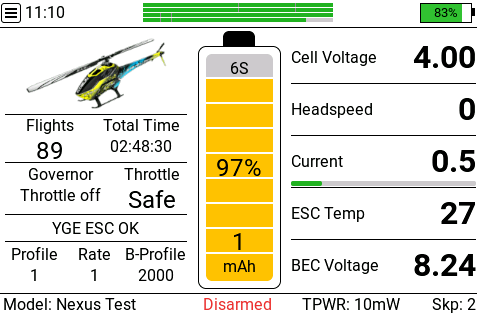

- **Top bar:** the **☰ menu glyph** (full-screen, disarmed) · the clock · the **ELRS link**
  as stacked bars · the radio battery.
- **Left panel:** the model image, **Flights / Total time**, **Governor + Throttle** state,
  the **ESC status** line (here *YGE ESC OK*), and **Profile / Rate / B-Profile**.
- **Centre:** the reserve-adjusted **battery gauge** (cell count, fuel %, used mAh).
- **Right panel:** five freely assignable value slots (cell voltage, headspeed, current,
  ESC temp, BEC…).
- **Bottom bar:** model name, arm state, TX power, skipped-packet count.

In flight the same view goes live — governor spooling up, headspeed, throttle and current
all update in real time:

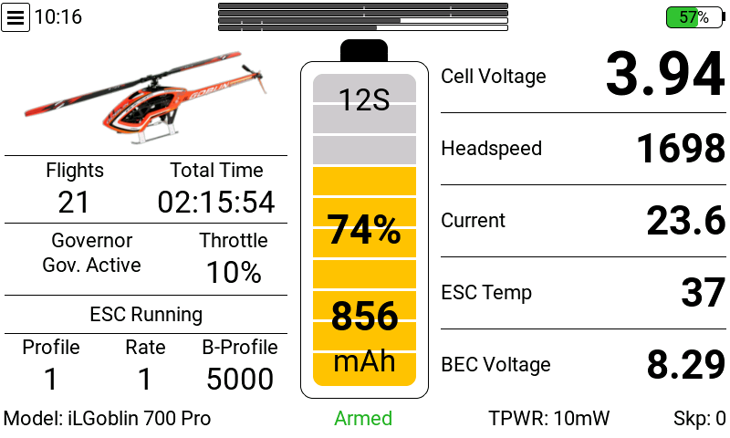

---

## Tap a panel → detail pages

In full-screen, tapping a panel drills into it. Tap anywhere (or **RTN**) to close.

### Battery — tap the gauge
Cell-voltage scale with the active thresholds (crit / low / full, from the FC config) and
the battery in the dashboard look.

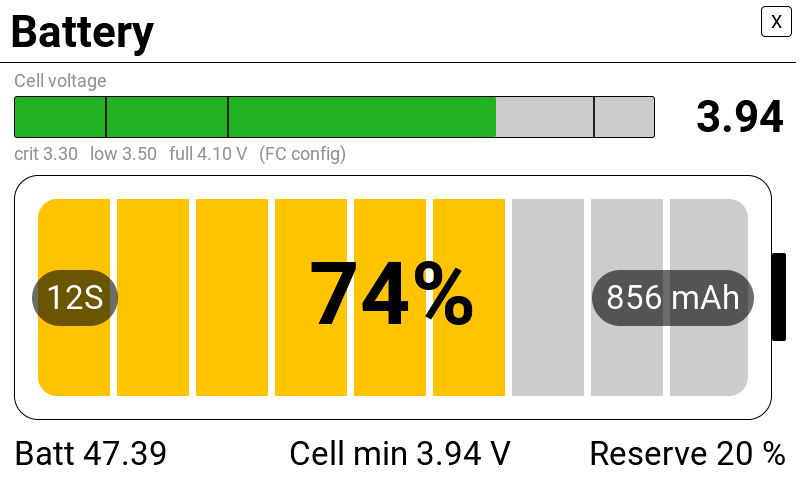

### Telemetry — tap the value panel
A grid of up to 12 chosen sensors, each with its unit and the EdgeTX session **low..high**.

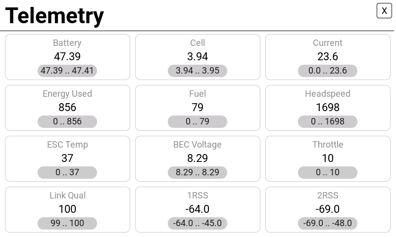

### ELRS link — tap the top-bar bars
RQ, TQ, 1RSS, 2RSS, downlink RSSI/SNR (TRSS), SNR and TPWR as labelled bars, plus the
active antenna, diversity state and session RQ-min.

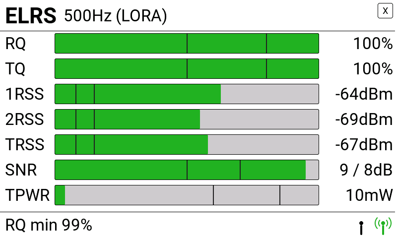

### Status & events — tap the status line
Arm / governor / throttle summary, the live status line and a timestamped ESC event log.

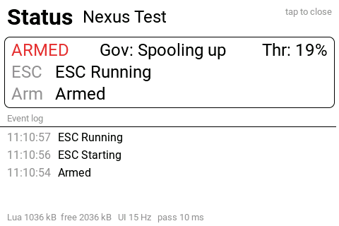

---

## The menu

Tap the **☰ glyph** (disarmed) to open the menu hub.

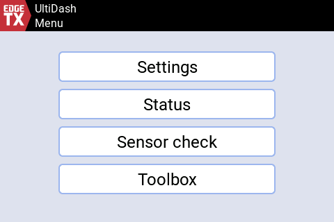

### Settings
A themed grid — *Appearance*, *Battery & limits*, *Sound & callouts*, *System* — each group
opens its own page of real toggles, dropdowns and steppers. Saved per EdgeTX model.

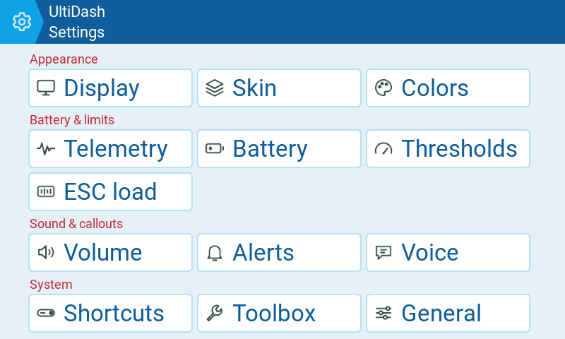

### Status overview
A read-only summary of the active configuration — cell thresholds & their source, link and
RSSI limits, alert levels.

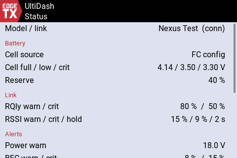

### Sensor check
Lists every sensor UltiDash needs and flags each **OK / no data / missing**, with a note on
what a gap breaks — the fastest way to confirm your telemetry is complete.

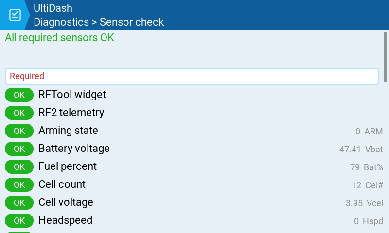

---

## Toolbox

On-demand tool pages (disarmed), lazy-loaded so they cost no memory while flying.

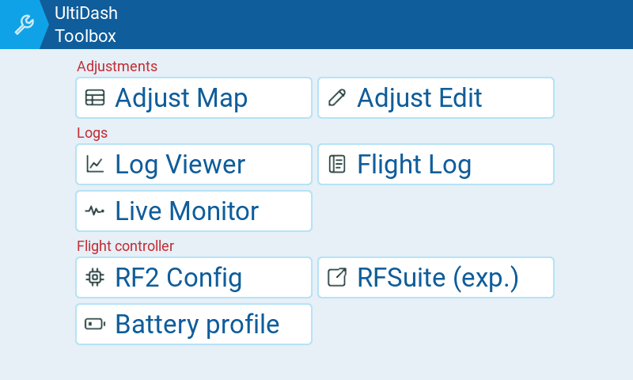

### Log Viewer
Graph the radio's own `/LOGS` telemetry CSVs on-screen. Pick a built-in set (Power /
Battery / RF link / Governor) or your own sensors…

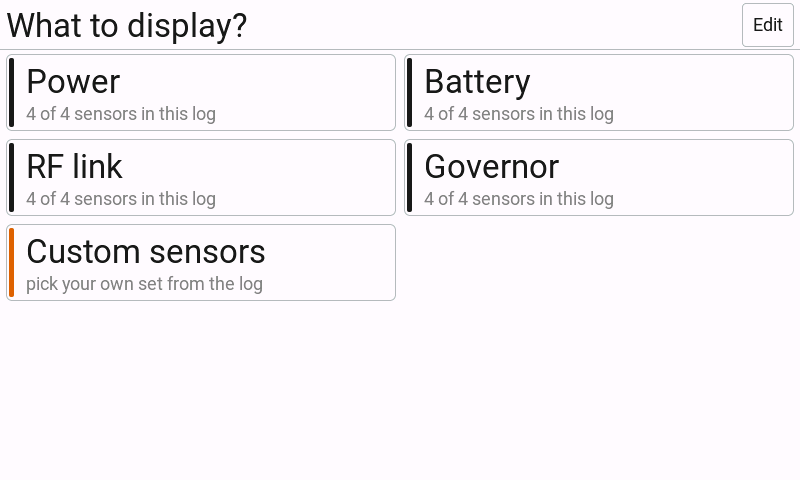

…then zoom, pan and drag a time cursor over up to four curves:

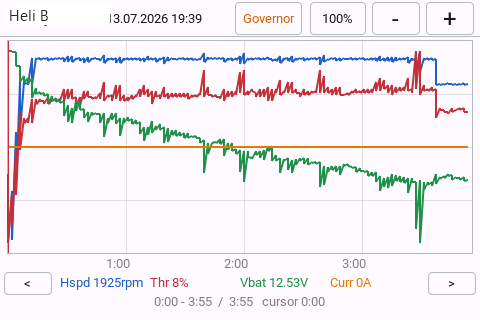

### Flight Log
Browse the flight history UltiDash records on the SD card — three tabs:

| Flights | Per model | Batteries |
|---|---|---|
| 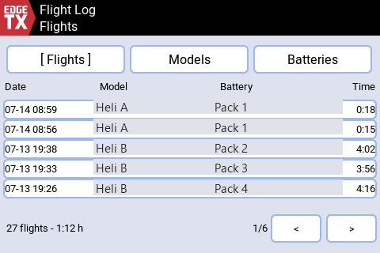 | 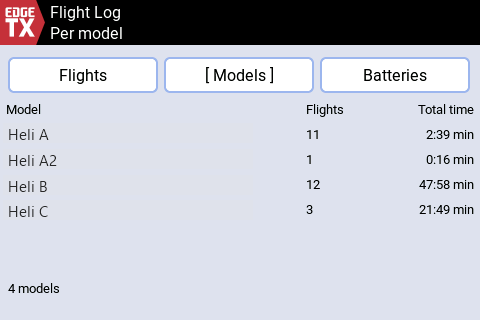 | 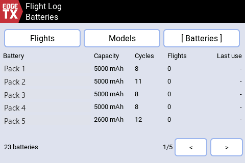 |

*Also in the Toolbox:* **RF2 Config** (the full Rotorflight FC configuration, run right on
the radio) and the **RF Adjustment** Map / Editor — see [TOOLBOX.md](TOOLBOX.md).

---

## Dark theme

Every screen also comes in the high-contrast **UltiDash dark** palette (and an EdgeTX-theme
option). Switch it under *Settings ▸ Skin ▸ Color scheme* — the colour scheme belongs to the
active skin since 0.7.0.

| | |
|---|---|
| 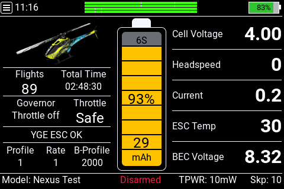 | 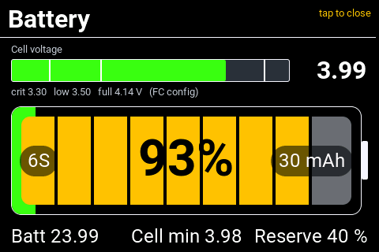 |
| 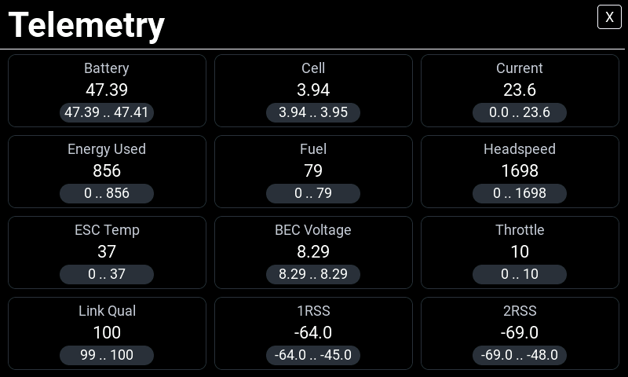 | 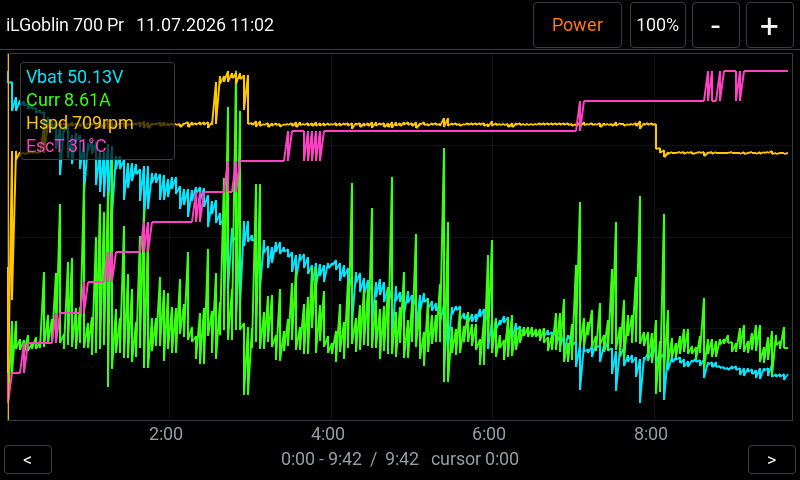 |

---

That's the tour. For the how and why behind each screen, see **[REFERENCE.md](REFERENCE.md)**.
